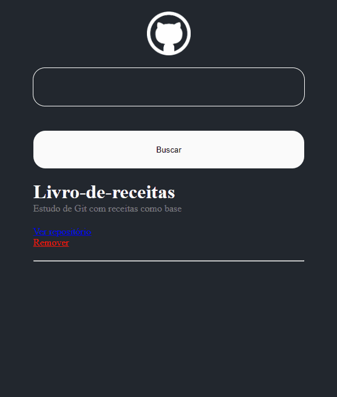

# GitWiki DIO

Projeto para a pesquisa de repositórios no Github consumindo a API deste, você pode pesquisar qualquer repositório público digitando nome-do-usuário/repositório, é possível se redirecionar para o repositório pelo projeto bem como remover projetos já listados da visualização!
Projeto feito com base na formação React da [DIO](https://dio.me/sign-up?ref=9RS1X8XBOV)
Você testar o projeto [clicando aqui](https://git-wiki-rho.vercel.app/)

# imagens do projeto

## Tecnologias utilizadas

* JavaScript
* HTML
* CSS
* React